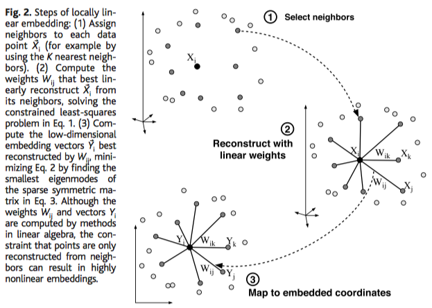
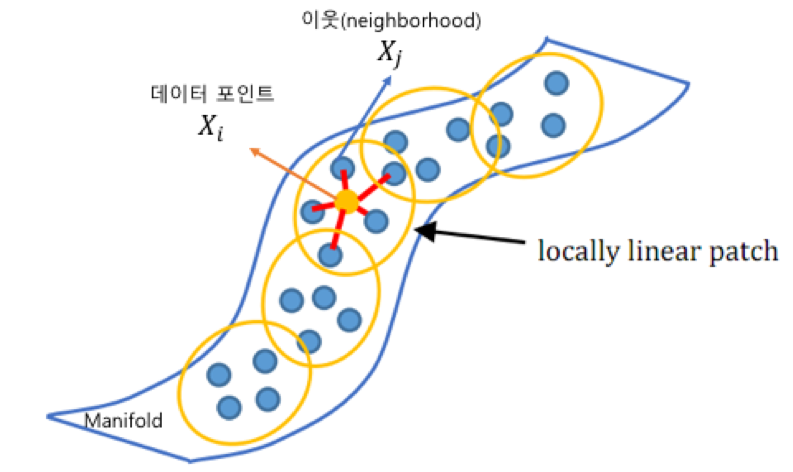
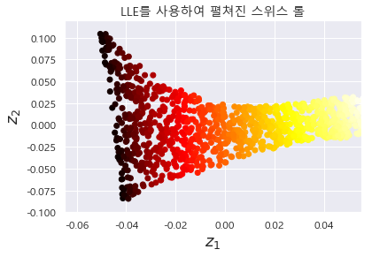
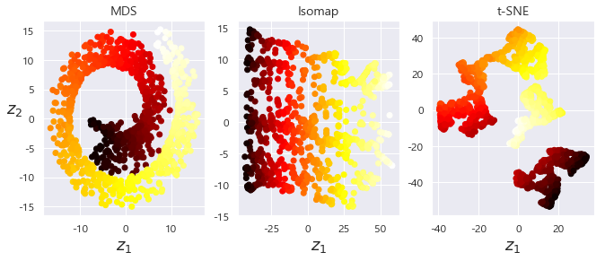

# 차원 축소 - Locally Linear Embedding (LLE)


> 이번 포스팅은  [Nonlinear Dimensionality Reduction by Locally Linear Ebedding](http://www.robots.ox.ac.uk/~az/lectures/ml/lle.pdf) (Roweis et.al) 논문과  [핸즈온 머신러닝](http://www.yes24.com/24/goods/59878826?scode=032&OzSrank=1) 교재를 가지고 공부한 것을 정리한 것입니다.


## 1. LLE - Locally Linear Embedding 란?

**LLE**(Locally Liner Embedding, 지역 선형 임베딩)는 [Nonlinear Dimensionality Reduction by Locally Linear Ebedding](http://www.robots.ox.ac.uk/~az/lectures/ml/lle.pdf) (Roweis et.al) 논문에서 제안된 알고리즘이다. LLE는 **비선형 차원 축소**(NonLinear Dimensionality Reduction, NLDR) 기법으로 '[차원 축소 - PCA, 주성분분석 (1)](http://excelsior-cjh.tistory.com/167)' 포스팅에서 살펴본 PCA와 달리 투영(projection)이 아닌 **매니폴드 학습**(manifold learning) 이다.


LLE는 머신러닝 알고리즘 중 Unsuperviesed Learning에 해당하며, 서로 인접한 데이터들을 보존(neighborhood-preserving)하면서 고차원인 데이터셋을 저차원으로 축소하는 방법이다. 즉, LLE는 입력 데이터셋을 낮은 차원의 단일 글로벌 좌표계(single global coordinate system)으로 매핑하는 알고리즘이다.


## 2. LLE 알고리즘

LLE의 과정은 아래 논문의 그림과 같이 크게 세 단계로 나눌 수 있다.

1. **Step 1**: Select neighbors 
2. **Step 2**: Reconstruct with linear weights
3. **Step 3**: Map to embedded coordinates




LLE 알고리즘을 각 단계별로 자세히 살펴보도록 하자.


### Step 1: Select Neighbors

먼저, $N$-차원($N$-Features)을 가지는 $m$-개의 데이터셋의 각 데이터 포인트 $X_i$에 대해, $X_i$와 가장 가까운 $k$-개의 이웃점($k$-nearest neighbors) $X_j$, $(j=1, \dots, k)$ 들을 선택한다. 여기서 $k$는 하이퍼파라미터(hyper-parmeter)로써 사람이 직접 적절한 개수를 정해준다.


### Step 2: Reconstruct with linear weights

LLE는 'Step 1'에서 선택한 각 데이터 포인트 $\vec{x_i}$와 그리고 $x_i$에 가까운 $k$-개의 이웃점들 $\vec{x_j}$  $(j=1,\dots,k)$는 매니폴드의 **locally linear patch** 상에 있거나 가까이 있을 것이라 가정한다. 




이러한 가정을 바탕으로 해당 데이터 포인트 $\vec{x_i}$와 가장 가까운 $k$-개의 이웃들 $\vec{x_j}$로 부터 $\vec{x_i}$를 가장 잘 **재구성(reconstruction)**하는 가중치 $w_{ij}$를 구한다. 즉, 이웃점 $\vec{x_j}$에 대해  $w_{ij}$와의 행렬 곱을 통해 $\sum_{j=1}^{k}{w_{ij}\vec{x}_j} \approx \vec{x}_i$를 만족하는 $w_{ij}$를 구하는 것이다. $\vec{x}_i$와 $\sum_{j=1}^{k}{w_{ij}\vec{x}_j}$ 간의 오차(error)를 Reconstruction error라 하고 다음과 같이 식으로 나타낼 수 있다.
$$
\varepsilon_{i} (\mathbf{w}) = \left\| \vec{x_i} - \sum_{\underset{j \neq i}{j=1}}^{k}{w_{ij}\vec{x_j}} \right\|^{2}
$$

따라서, 위의 식 $\varepsilon_{i}(\mathbf{w})$를 **최소화(minimize)** 하는 문제이며, 이때의 제약식은 $\sum_{j=1}^{k}{w_{ij}} = 1$이다. 이를 식으로 나타내면 다음과 같다. 
$$
\text{min} \quad \varepsilon_i (\mathbf{w}) = \left\| \vec{x_i} - \sum_{\underset{j \neq i}{j=1}}^{k}{w_{ij}\vec{x_j}} \right\|^{2}
$$

$$
\text{s.t.} \quad \sum_{\underset{j \neq i}{j=1}}^{k}{w_{ij}} = 1
$$


위의 식에서 $\vec{x_i}, \vec{x_j}$에 어떤 상수 벡터 $\vec{c}$를 더하거나 해도 $w_{ij}$를 최소화하는데 아무런 영향을 주지 않는다. 
$$
\begin{align*}
\varepsilon_i(\mathbf{w}) &= \left\| \vec{x_i} + \vec{c} - \sum_{\underset{j \neq i}{j=1}}^{k}{w_{ij} \left( \vec{x_j} + \vec{c} \right)} \right\|^{2} \\ &= \left\| \vec{x}_i + \vec{c} - \sum_{\underset{j \neq i}{j=1}}^{k}{w_{ij}\vec{x}_{j}} - \vec{c} \right\|^{2} \\ &= \left\| \vec{x_i} - \sum_{\underset{j \neq i}{j=1}}^{k}{w_{ij}\vec{x_j}} \right\|^{2}
\end{align*}
$$


만약, 위의 식 $\vec{c} = -\vec{x}_i$ 라고 한다면 아래와 같이 나타낼 수 있다.
$$
\begin{align*}
\varepsilon_i (\mathbf{w}) &= \left\| \sum_{\underset{j \neq i}{j=1}}^{k}{w_{ij}\left( \vec{x}_{j} - \vec{x}_{i} \right)} \right\|^{2} \\ &= \left\| \sum_{\underset{j \neq i}{j=1}}^{k}{w_{ij} \vec{z}_{j}} \right\|^{2}, \quad (\vec{z}_{j} = \vec{x}_{j} - \vec{x}_{i})
\end{align*}
$$


$\mathbf{w}_i = \sum_{j=1}^{k}{w_{ij}}$는 $(k \times 1)$-행렬이고, $\mathbf{z} = \sum_{j=1}^{k}{\vec{z}_{j}}$는 $(k \times N)$-행렬이므로 위의 식을 행렬 형태로 나타내면 아래와 같다.
$$
\begin{align*}
\left\| \sum_{\underset{j \neq i}{j=1}}^{k}{w_{ij} \vec{z}_{j}} \right\|^{2} &= \left( \mathbf{z}^{T} \mathbf{w}_i \right)^{T}\left( \mathbf{z}^{T} \mathbf{w}_i \right) \\ &= \mathbf{w}_{i}^{T} \mathbf{z} \mathbf{z}^{T} \mathbf{w}_{i} \\ &= \mathbf{w}_{i}^{T} \mathbf{G}_{i} \mathbf{w}_{i}, \quad (\mathbf{G}_{i} = \mathbf{z}\mathbf{z}^{T})
\end{align*}
$$


위의 식에서 $\mathbf{G}_{i}$는 symmetric 한 행렬이며, 이러한 행렬을 [**Gram Matrix**](https://en.wikipedia.org/wiki/Gramian_matrix) 라고 한다.  $\mathbf{G}_{i}$는 선택한 데이터 포인트 $\vec{x}_i$에 대응되는 Gram Matrix 이다. 

이러한 과정을 통해  $\varepsilon_i (\mathbf{w})$를 최소화 하는 문제를 다음과 같은 식으로 나타낼 수 있다.
$$
\text{min} \quad \varepsilon_i (\mathbf{w}) = \left\| \vec{x_i} - \sum_{\underset{j \neq i}{j=1}}^{k}{w_{ij}\vec{x_j}} \right\|^{2} = \mathbf{w}_{i}^{T} \mathbf{G}_{i} \mathbf{w}_{i}
$$

$$
\text{s.t.} \quad \sum_{\underset{j \neq i}{j=1}}^{k}{w_{ij}} = 1 = \mathbf{1}^{T} \mathbf{w}_{i}
$$

$\mathbf{1}$은 $(k \times 1)$-행렬이 모두 1로 구성된 행렬을 의미한다. 


위의 식을 ['서포트벡터머신, SVM'](http://excelsior-cjh.tistory.com/165)에서 살펴본 라그랑제 승수법을 이용하여 계산할 수 있다. 위의 식을 라그랑지안 함수 $L$로 나타내면 다음과 같다 ($\lambda$는 라그랑제 승수이다).
$$
L(\mathbf{w}_{i}, \lambda) = \mathbf{w}_{i}^{T} \mathbf{G}_{i} \mathbf{w}_{i} - \lambda \left( \mathbf{1}^{T} \mathbf{w}_{i} - 1 \right)
$$


이렇게 라그랑지안으로 나타낸 함수 $L$ 을 $\mathbf{w_i}$에 대한 편미분 $\frac{\partial L}{\partial \mathbf{w}_{i}} = 0$을 통해 $\mathbf{w}_{i}$를 구할 수 있다.
$$
\begin{align*}
\frac{\partial L}{\partial \mathbf{w}_{i}} &= \left( \mathbf{G}_{i} + \mathbf{G}_{i}^{T} \right) \mathbf{w}_{i} - \lambda \mathbf{1}, \quad (\mathbf{G}_{i} = \mathbf{G}_{i}^{T}) \\ &= 2 \mathbf{G}_{i} \mathbf{w}_{i} - \lambda \mathbf{1} \\ &= 0
\end{align*}
$$

$$
\therefore \mathbf{w}_{i} = \frac{\lambda}{2} \mathbf{G}_{i}^{-1} \mathbf{1}
$$


### Step 3: Map to Embedded Coordinates

'Step 2'에서 구한 가중치 $w_{ij}$는 데이터 포인트 $\vec{x}_i$와 이웃점들 $\vec{x}_j$간의 지역 선형 관계(locally linear relationship)를 나타낸다. 마지막 단계인 'Step 3'에서는 이러한 관계가 최대한 보존 되도록 데이터를 저차원인 $d$-차원 공간($d < N$)으로 매핑(mapping)한다.  이 때, $\vec{y}_i$를 $d$-차원 공간에서의 $\vec{y}_i$의 상(image, $\vec{x}_i \mapsto \vec{y}_i$를 의미) 이라고 한다면, $\vec{y}_i$와 $d$-차원 공간에서의 이웃점들 $\vec{y}_j$에 대해 재구성(reconstructed)된 $\sum_{j=1}^{k}{w_{ij}} \vec{y}_j$ 사이의 거리를 최소화하는 $\mathbf{Y}$를 찾는 최소화 문제가 된다. 여기서 $w_{ij}$는 'Step 2'에서 구한 $w_{ij}$이다. 이를 식으로 나타내면 다음과 같다.
$$
\text{min} \quad \Phi(\mathbf{Y}) = \sum_{i=1}^{m}{\left\| \vec{y}_{i} - \sum_{\underset{j \neq i}{j=1}}^{k}{w_{ij}\vec{y}_{j}} \right\|^{2}}
$$


이 때, 논문에서는 위의 최소화 문제가 잘 풀리기(well-posed) 위해 다음과 같은 제약식을 추가해 준다.
$$
\text{s.t.} \quad \begin{cases} \frac{1}{m} \sum_{i=1}^{m}{\vec{y}_i} = 0 \\ \\ \frac{1}{m} \mathbf{Y}^{T} \mathbf{Y} = \mathbf{I} \end{cases}
$$
위의 제약식을 살펴보면, ['차원축소 - PCA'](http://excelsior-cjh.tistory.com/167)에서 공분산 구하는 방법을 살펴본 것과 같이 $d$-차원 공간상에 매핑된 $m$-개의 데이터셋($\mathbf{Y}$)에서 데이터 포인트 $\vec{y}_{i}$의 평균은 $0$이고, $\mathbf{Y}$의 공분산(covariance)는 $\mathbf{I}$ (identity) 행렬인 것을 알 수 있고, $\mathbf{Y}$은 symmetric 한것을 알 수 있다. 

위의 $\Phi (\mathbf{Y})$는 아래와 같이 풀어서 나타낼 수 있다.
$$
\begin{align*}
\Phi (\mathbf{Y}) &= \sum_{i=1}^{m}{\left\| \vec{y}_{i} - \sum_{\underset{j \neq i}{j=1}}^{k}{w_{ij}\vec{y}_{j}} \right\|^{2}} \\ &= \sum_{i=1}^{m}{\left[ \vec{y}_{i}^{2} - \vec{y}_{i} \left( \sum_{j=1}^{k}{w_{ij} \vec{y}_{j}} \right) - \left( \sum_{j=1}^{k}{w_{ij} \vec{y}_{j}} \right)\vec{y}_{i} + \left( \sum_{j=1}^{k}{w_{ij} \vec{y}_{j}} \right)^{2} \right]} \\ &= \mathbf{Y}^{T}\mathbf{Y} - \mathbf{Y}^{T} (\mathbf{wY}) - (\mathbf{wY})^{T}\mathbf{Y} + (\mathbf{wY})^{T} (\mathbf{wY}) \\ &= \left( \mathbf{Y}^{T} - \mathbf{Y}^{T}\mathbf{w}^{T} \right) \mathbf{Y} - \left( \mathbf{Y}^{T} - \mathbf{Y}^{T}\mathbf{w}^{T} \right) \mathbf{w}\mathbf{Y} \\ &= \mathbf{Y}^{T} \left( \mathbf{I} - \mathbf{w}^{T} \right) \mathbf{Y} - \mathbf{Y}^{T} \left( \mathbf{I} - \mathbf{w}^{T} \right) \mathbf{wY} \\ &= \mathbf{Y}^{T} \left( \mathbf{I} - \mathbf{w}^{T} \right) \left( \mathbf{Y} - \mathbf{wY} \right) \\ &= \mathbf{Y}^{T} \left( \mathbf{I} - \mathbf{w}^{T} \right)\left( \mathbf{I} - \mathbf{w} \right) \mathbf{Y} \\ &= \mathbf{Y}^{T} \left( \mathbf{I} - \mathbf{w} \right)^{T} \left( \mathbf{I} - \mathbf{w} \right) \mathbf{Y}, \quad \left( \mathbf{M} =  \left( \mathbf{I} - \mathbf{w} \right)^{T} \left( \mathbf{I} - \mathbf{w} \right) \right) \\ &= \mathbf{Y}^{T} \mathbf{M} \mathbf{Y}
\end{align*}
$$


따라서, 위의 최소화 문제를 다음과 같이 나타낼 수 있다.
$$
\text{min} \quad \Phi (\mathbf{Y}) = \mathbf{Y}^{T} \mathbf{M} \mathbf{Y}
$$

$$
\text{s.t.} \begin{cases} \frac{1}{m} \sum_{i=1}^{m}{\vec{y}_i} = 0 \\ \\ \frac{1}{m} \mathbf{Y}^{T} \mathbf{Y} = \mathbf{I} \end{cases}
$$


위의 식을 라그랑제 승수 $\alpha$를 이용해 라그랑지안 함수 $L$로 나타내면 아래의 식과 같다.
$$
L(\mathbf{Y}, \alpha) = \mathbf{Y}^{T} \mathbf{M} \mathbf{Y} - \alpha \left( m^{-1} \mathbf{Y}^{T}\mathbf{Y} - \mathbf{I} \right)
$$

이렇게 라그랑지안 함수로 나타낸 함수 $L$을 $\mathbf{Y}$에 대한 편미분 $\frac{\partial L}{\partial \mathbf{Y}} = 0$을 통해 $\mathbf{Y}$를 구할 수 있다.  
$$
\begin{align*}
\frac{\partial L}{\partial \mathbf{Y}} &= \left( \mathbf{Y} + \mathbf{Y}^{T} \right) \mathbf{M} - \frac{2}{m} \alpha \mathbf{Y} \\ &= 2 \mathbf{M}\mathbf{Y} - \frac{2}{m} \alpha \mathbf{Y} \\ &= 0
\end{align*}
$$

$$
\therefore \mathbf{M} \mathbf{Y} = \frac{\alpha}{m} \mathbf{Y} 
$$


위의 결과에서, $\mathbf{Y} $는 $\mathbf{M} $의 **eigenvectors** 인 것을 알 수 있고, $\frac{\alpha}{m}$은 **eigenvalue**인 것을 알 수 있다. 위의 문제는 $\mathbf{Y}$를 찾는 것이며, PCA와는 다르게 $\mathbf{Y} $ 중에서도 가장 값을 최소화하는 eigenvector인 맨 오른쪽에 위치하는 열벡터이다. 


#### 계산 복잡도

LLE 알고리즘의 계산 복잡도는 다음과 같다.

- $k$-개의 가까운 이웃 찾기 : $O(m\log{(m)}n\log{(k)})$ 
- 가중치 $w_{ij}$ 최적화: $O(mnk^{3})$
- 저차원으로의 매핑: $O(dm^{2})$

마지막의 저차원으로의 매핑의 복잡도에서 $m^{2}$ , 전체 데이터 셋의 제곱이므로 LLE 알고리즘은 대용량의 데이터셋에 적용하기는 어려운 점이 있다.


## 3. Scikit-Learn을 이용한 LLE 예제

Scikit-Learn에서는 [`LocallyLinearEmbedding`](http://scikit-learn.org/stable/modules/generated/sklearn.manifold.LocallyLinearEmbedding.html)클래스를 이용해 LLE를 구현할 수 있다. 아래의 예제는 스위스롤 예제 데이터를 LLE를 이용해 차원 축소하는 코드이다.

```python
from sklearn.datasets import make_swiss_roll
from sklearn.manifold import LocallyLinearEmbedding

# create sample dataset
X, t = make_swiss_roll(n_samples=1000, noise=0.2, random_state=41)

lle = LocallyLinearEmbedding(n_components=2, n_neighbors=10, random_state=42)
lle.fit(X)
```

```
LocallyLinearEmbedding(eigen_solver='auto', hessian_tol=0.0001, max_iter=100,
            method='standard', modified_tol=1e-12, n_components=2,
            n_jobs=1, n_neighbors=10, neighbors_algorithm='auto',
            random_state=42, reg=0.001, tol=1e-06)
```

```python
X_reduced = lle.transform(X)

plt.title("LLE를 사용하여 펼쳐진 스위스 롤", fontsize=14)
plt.scatter(X_reduced[:, 0], X_reduced[:, 1], c=t, cmap=plt.cm.hot)
plt.xlabel("$z_1$", fontsize=18)
plt.ylabel("$z_2$", fontsize=18)
plt.axis([-0.065, 0.055, -0.1, 0.12])
plt.grid(True)

plt.show()
```




## 4. 다른 차원 축소 기법

위에서 살펴본 PCA, LLE 차원 축소 알고리즘 외에 MDS, IsoMap, t-SNE, LDA 등 다양한 차원 축소 알고리즘들이 있다. 그 중에서 인기있는 차원 축소 알고리즘을 간단하게 알아보도록 하자.

- **MDS**(Multi-Dimensional Scaling): MDS는 데이터 포인트 간의 거리를 보존하면서 차원을 축소하는 기법이다. 
- **Isomap**: Isomap은 각 데이터 포인트를 가장 가까운 이웃과 연결하는 식의 그래프를 만든 후 그래프에서 두 노드 사이의 최단 경로를 이루는 노드의 수인  **geodesic distance**를 유지 하면서 차원을 축소한다.
- **t-SNE**(t-distributed Stochastic Neighbor Embedding): t-SNE는 비슷한 데이터는 가까이, 비슷하지 않은 데이터는 멀리 떨어지도록 차원을 축소한다. 주로 시각화에 많이 사용되며, 특히 고차원 공간에 있는 데이터의 군집을 시각화할 때 사용한다.
- **LDA**: LDA는  Supervised learning이며, 분류 알고리즘에 속한다. LDA는 학습 단계에서 클래스를 가장 잘 구분하는 축을 학습하며, 이 축은 데이터가 투영되는 초평면을 정의하는 데 사용할 수 있다. 이러한 초평면으로 데이터를 투영하게 되면 클래스 간의 거리를 멀리 떨어지게 축소할 수 있다.


아래의 예제는 Scikit-Learn을 이용해 MDS, Isomap, t-SNE를 구현한 코드이다.

```python
from sklearn.datasets import make_swiss_roll

X, t = make_swiss_roll(n_samples=1000, noise=0.2, random_state=41)
```

```python
from sklearn.manifold import MDS, Isomap, TSNE

# MDS
mds = MDS(n_components=2, random_state=42)
X_reduced_mds = mds.fit_transform(X)

# Isomap
isomap = Isomap(n_components=2)
X_reduced_isomap = isomap.fit_transform(X)

# t-SNE
tsne = TSNE(n_components=2, random_state=42)
X_reduced_tsne = tsne.fit_transform(X)
```

```python
titles = ["MDS", "Isomap", "t-SNE"]

plt.figure(figsize=(11,4))

for subplot, title, X_reduced in zip((131, 132, 133), titles,
                                     (X_reduced_mds, X_reduced_isomap, X_reduced_tsne)):
    plt.subplot(subplot)
    plt.title(title, fontsize=14)
    plt.scatter(X_reduced[:, 0], X_reduced[:, 1], c=t, cmap=plt.cm.hot)
    plt.xlabel("$z_1$", fontsize=18)
    if subplot == 131:
        plt.ylabel("$z_2$", fontsize=18, rotation=0)
    plt.grid(True)

plt.show()
```




## 5. 마무리

이번 포스팅에서는 차원 축소 알고리즘인 LLE와 그 밖의 MDS, Isomap, t-SNE 등의 차원축소 알고리즘을 간단하게 알아 보았다. 위의 코드에 대한 전체 코드는 https://github.com/ExcelsiorCJH/Hands-On-ML/blob/master/Chap08-Dimensionality_Reduction/Chap08-Dimensionality_Reduction.ipynb 에서 확인할 수 있다.