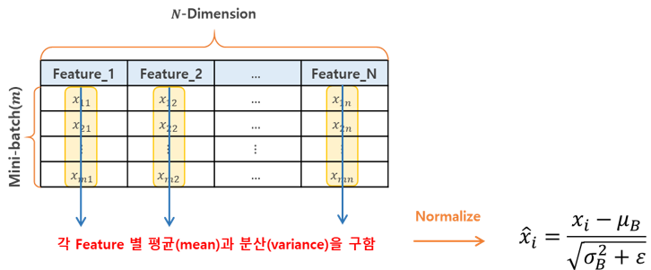
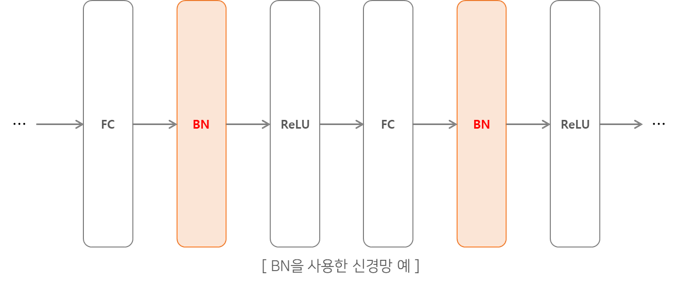
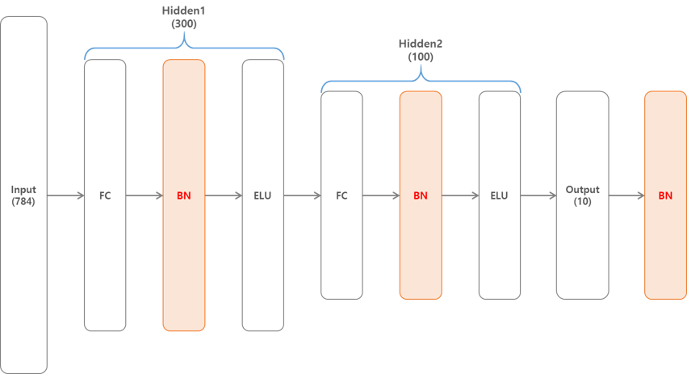

# 5-2. 심층 신경망 학습 (2)


저번 포스팅 [05-1. 심층 신경망 학습](http://excelsior-cjh.tistory.com/177)에서는 DNN 학습에 있어서 적절한 활성화 함수 및 가중치 초기화 방법에 대해 알아보았다. 이번 포스팅에서는 그래디언트 소실(vanishing gradient)과 폭주(exploding) 문제를 해결하는 방법인 **배치 정규화(BN, Batch Normalization)**와 그래디언트 클리핑(Gradient Clipping), 그리고 학습 속도를 높일 수 있는 최적화(Optimization) 방법에 대해 알아보도록 하자.


## 1. 배치 정규화(BN, Batch Normalization)

[05-1. 심층 신경망 학습](http://excelsior-cjh.tistory.com/177)에서는 활성화 함수로는 ReLU를 사용하고 He 초기화를 통해 학습 초기 단계에서의 그래디언트 소실/폭주 문제를 줄일 수 있었지만, 이러한 문제가 학습하는 동안에 또 다시 발생할 가능성이 있다.

2015년 Sergety Ioffe와 Christian Szegedy는 ['Batch Normalization: Accelerating Deep Network Training by Reducing Internal Covariate Shift'](https://arxiv.org/pdf/1502.03167v3.pdf)라는 논문에서 **배치 정규화**(BN, Batch Normalization)를 제안했다.  배치 정규화는 각 층의 활성화 함수의 출력값 분포가 골고루 분포되도록 '강제'하는 방법으로, 각 층에서의 활성화 함수 출력값이 정규분포(normal distribution)를 이루도록 하는 방법이다. 

즉, 학습하는 동안 이전 레이어에서의 가중치 매개변수가 변함에 따라 활성화 함수 출력값의 분포가 변화하는 **내부 공변량 변화(Internal Covariate Shift) 문제를 줄이는 방법**이 바로 배치 정규화 기법이다.

배치 정규화는 아래의 그림과 같이 미니배치(mini-batch)의 데이터에서 각 feature(특성)별 평균($\mu$, mean)과 분산($\sigma^{2}$, variance)을 구한 뒤 정규화(normalize) 해준다.




일반적으로 배치 정규화는 아래의 그림과 같이 Fully Connected(FC)나 Convolutional layer 바로 다음, 활성화 함수를 통과하기 전에 배치 정규화(BN)레이어를 삽입하여 사용한다.




배치 정규화는 미니배치(mini-batch)를 단위로 데이터의 분포가 평균($\mu$, mean)이 0, 분산($\sigma^{2}$, variance)이 1이 되도록 정규화(normalization)한다.  수식은 다음과 같다.

- **Input** : 미니배치 $B = \{ x_1, x_2, \dots, x_m \}$ 개의 입력 데이터, 학습 될 파라미터인 $\gamma, \beta$
- **Output** : $\{ y_i = \text{BN}_{\gamma, \beta}(x_i) \}$

$$
\begin{eqnarray*} \mu _{ B } & \leftarrow  & \frac { 1 }{ m } \sum _{ i=1 }^{ m }{ x_{ i } } & \text{// mini-batch mean}  \\ \sigma _{ B }^{ 2 } & \leftarrow  & \frac { 1 }{ m } \sum _{ i=1 }^{ m }{ \left( x_{ i }-\mu _{ B } \right) ^{ 2 } } & \text{// mini-batch variance}  \\ \hat { x } _{ i } & \leftarrow  & \frac { x_{ i }-\mu _{ B } }{ \sqrt { \sigma _{ B }^{ 2 }+\varepsilon }} & \text{// normalize} \\ y_{i} & \leftarrow & \gamma \hat{x}_{i} + \beta \equiv \text{BN}_{\gamma, \beta}(x_i) & \text{// scale and shift} \end{eqnarray*}
$$


- $\mu_B$ : 미니배치 $B$에 대한 평균
- $\sigma_B$ : 미니배치 $B$에 대한 표준편차
- $m$ : 미니배치 데이터 개수
- $\hat{x}_i$ : 평균이 0, 분산이 1로 정규화된 입력 데이터
- $\gamma$ : 정규화된 데이터에 대한 스케일(scale) 조정 파라미터
- $\beta$ : 정규화된 데이터에 대한 이동(shift) 조정 파라미터
- $\varepsilon$ : 분모가 0이 되는 것을 막기 위한 작은 숫자 ($10^{-5}$)
- $y_i$ : $\text{BN}$ 연산의 출력 결과 


### 1.1 Scale($\gamma$)과 Shift($\beta$)를 해주는 이유

위의 식에서 입력 데이터($x_i$)에 대해 정규화(normalization, $\hat{x}_i = \frac{x_i - \mu_B}{\sqrt{\sigma_{B}^{2}+\varepsilon}}$)를 하게 되면, $\hat{x}_i$의 값이 대부분 0에 가까운 값이 될 것이다. 만약, 이러한 정규화된 입력 데이터 $\hat{x}_{i}$가 시그모이드(sigmoid) 활성화 함수의 입력값으로 들어가게 되면, 비선형(nonlinearity) 함수인 sigmoid가 선형(linearity)구간에 빠지게 된다(sigmoid 함수는 0 부근에서 선형성을 띤다). 이러한 문제를 해결하기 위해서 아래의 식과 같이 정규화된 입력 데이터 $x_i$에 scaling과 shifting해주는 $\gamma$와 $\beta$를 적용 해준다.

$$
y_i = \color{red}{\gamma} \color{black} \hat{x}_i + \color{red}{\beta}
$$


 $\gamma$와 $\beta$를 다르게 표현하면 $\hat{x}_i$에 대한 가중치($\gamma$) 와 편향(bias, $\beta$)라고 볼 수 있으며,  $\gamma$와 $\beta$는 초기값으로 $\gamma=1, \beta=0$으로 시작해(즉, 초기에는 입력값 그대로 학습), 학습 과정에서 역전파(backprop)에 의해 적합한 값으로 조정된다.


### 1.2 테스트(추론) 단계에서의 BN

테스트 단계(추론 단계처럼 데이터가 하나씩 주입된다고 가정)나 추론 단계에서는 평균($\mu_B$)과 표준편차($\sigma_{B}$)를 계산할 미니배치가 없기 때문에 전체 Training Set의 평균과 표준편차를 사용한다. 하지만, 엄청나게 많은 전체 Training set에 대한 평균과 표준편차를 계산하기에는 무리기 때문에, 아래의 식과 같이 각 $n$개의 미니배치에 대한 평균과 표준편차를 이용해 전체 Training Set의 평균과 표준편차를 대신한다.
$$
\begin{align*}
\hat{\mu} &= \frac{1}{n} \sum_{i=1}^{n}{\mu_{B}^{(i)}} \\ \hat{\sigma} &= \frac{1}{n} \sum_{i=1}^{n}{\sigma_{B}^{(i)}}
\end{align*}
$$
위와 같은 방법 대신, 모델 학습 단계에서 **지수 감소**(exponential decay) 이동 평균법(moving average)을 사용하여 평균과 표준편차를 계산할 수 있다. 
$$
\begin{align*}
\hat{\mu} & \leftarrow \alpha \hat{\mu} + \left(1 - \alpha \right)\mu_{B}^{(i)} & \text{// moving mean}\\ \hat{\sigma} & \leftarrow \alpha \hat{\sigma} + \left( 1 - \alpha \right) \sigma_{B}^{(i)} & \text{// moving stddev}
\end{align*}
$$

위의 식에서 $\alpha$는 모멘텀(momentum)값으로 일반적으로 1에 가까운 0.9, 0.99, 0.999로 설정한다.  이러한 moving mean과 moving stddev는 학습 단계에서 매 미니배치마다 업데이트 해준다.


### 1.3 BN의 장점

Batch Normalization(BN)은 논문에서 실험했던 모든 DNN의 성능이 크게 향상 시켰다. BN은 다음과 같은 장점들이 있다. 

- tanh나 sigmoid 같은 활성화 함수에 대해 그래디언트 소실(vanishing gradient)문제가 감소한다.
- 가중치 초기화에 덜 민감하다. 가중치 초기값에 크게 의존하지 않기 때문에 [05-1. 심층 신경망 학습](http://excelsior-cjh.tistory.com/177)에서 알아본 가중치 초기화 기법에 대해 크게 신경 쓰지 않아도 된다.
- 학습률(learning rate)를 크게 잡아도 gradient descent가 잘 수렴한다.
- 오버피팅을 억제한다. BN이 마치 Regularization 역할을 하기 때문에 드롭아웃(Dropout)과 같은 규제기법에 대한 필요성이 감소한다.  하지만, BN로 인한 규제는 효과가 크지 않기 때문에 드롭아웃을 함께 사용하는 것이 좋다.


### 1.4 텐서플로에서 Batch Normalization 구현하기

텐서플로(TensorFlow)에서는 [`tf.nn.batch_normalization()`](https://www.tensorflow.org/api_docs/python/tf/nn/batch_normalization)과 [`tf.layers.batch_normalization()`](https://www.tensorflow.org/api_docs/python/tf/layers/batch_normalization)을 통해 두 개의 Batch Normalization을 제공한다. 하지만, `tf.nn.batch_normalization`은 평균과 표준편차(학습할 때는 미니배치, 테스트할 때는 전체 데이터셋)를 직접 계산한 뒤 인자로 전달해줘야 하며, scaling과 shifting을 위한 $\gamma, \beta$를 만들어 줘야한다. 반면, `tf.layers.batch_normalization`은 이러한 작업들을 모두 처리해 주기 때문에 이것을 사용하는 것이 좋다. 

이제, `tf.layers.batch_normalization`을 이용하여 MNIST 데이터셋을 분류하는 DNN을 구현해 보도록 하자. DNN의 구성은 아래의 그림과 같이 784개의 입력층(input) → 300개 노드의 은닉층(hidden1) → 100개 노드의 은닉층(hidden2) → 10개의 출력층(output)으로 구성되어 있다.   




#### 1) MNIST DataSet Load

먼저, 학습과 테스트에 사용할 MNIST 데이터셋을 로드한 뒤 랜덤하게 미니배치 크기만큼 가져오기 위한 `shuffle_batch()` 함수를 구현하자.

```python
import tensorflow as tf

# MNIST Load
(train_x, train_y), (test_x, test_y) = tf.keras.datasets.mnist.load_data()

# Train & TestSet reshape
train_x = train_x.astype(np.float32).reshape(-1, 28*28) / 255.
train_y = train_y.astype(np.int32)
test_x = test_x.astype(np.float32).reshape(-1, 28*28) / 255.
test_y = test_y.astype(np.int32)

# Split Validation set from Train set
valid_x, train_x = train_x[:5000], train_x[5000:]
valid_y, train_y = train_y[:5000], train_y[5000:]

# mini-batch
def shuffle_batch(inputs, labels, batch_size):
    rnd_idx = np.random.permutation(len(inputs))
    n_batches = len(inputs) // batch_size
    for batch_idx in np.array_split(rnd_idx, n_batches):
        batch_x, batch_y = inputs[batch_idx], labels[batch_idx]
        yield batch_x, batch_y
```


#### 2) NN 구성하기

`tf.layers.batch_normalization()`처럼 배치 정규화가 반복해서 사용하기 때문에 코드 중복을 줄이기 위해 Python의 내장 모듈인 `functools`모듈 안에 있는 `partial()`함수를 사용해서 배치 정규화를 적용한다.

`tf.layers.batch_normalization`로 배치 정규화를 사용할 경우, '1.2 테스트(추론) 단계에서의 BN'에서 살펴본 moving mean과 moving variance를 업데이트를 해주기 위해 [`tf.GraphKeys.UPDATE_OPS`](https://www.tensorflow.org/api_docs/python/tf/GraphKeys#UPDATE_OPS)를 사용해야 한다

```python
from functools import partial

################
# layer params #
################
n_inputs = 28*28
n_hidden1 = 300
n_hidden2 = 100
n_outputs = 10
batch_norm_momentum = 0.9

# input layer
inputs = tf.placeholder(tf.float32, shape=[None, n_inputs], name="X")
# output layer
labels = tf.placeholder(tf.int32, shape=[None], name='labels')
# BN에 사용하기 위한 학습 유무
training = tf.placeholder_with_default(False, shape=[], name="training")

with tf.name_scope('dnn'):
    # batch normalization layer using partial
    batch_norm_layer = partial(
            tf.layers.batch_normalization,
            training=training, 
            momentum=batch_norm_momentum)

    # 1st - hidden
    hidden1 = tf.layers.dense(inputs, n_hidden1, name="hidden1")
    # batch norm
    bn1 = batch_norm_layer(hidden1)
    # activation function
    bn1_act = tf.nn.elu(bn1)

    # 2nd - hidden
    hidden2 = tf.layers.dense(bn1_act, n_hidden2, name="hidden2")
    bn2 = batch_norm_layer(hidden2)
    bn2_act = tf.nn.elu(bn2)

    # outputs
    logits_before_bn = tf.layers.dense(bn2_act, n_outputs, name="outputs")
    logits = batch_norm_layer(logits_before_bn)
    
with tf.name_scope('loss'):
    xentropy = tf.nn.sparse_softmax_cross_entropy_with_logits(labels=labels, logits=logits)
    loss = tf.reduce_mean(xentropy, name='loss')


################
# Hyper-params #
################
learning_rate = 0.01
n_epochs = 5
batch_size = 50

# moving mean & variance update
update_ops = tf.get_collection(tf.GraphKeys.UPDATE_OPS)
with tf.control_dependencies(update_ops):
    with tf.name_scope('train'):
        optimizer = tf.train.GradientDescentOptimizer(learning_rate)
        train_op = optimizer.minimize(xentropy)
    
with tf.name_scope('eval'):
    correct = tf.nn.in_top_k(logits, labels, 1)
    accuracy = tf.reduce_mean(tf.cast(correct, tf.float32))
```


#### 3) 학습 시키기(Training)

```python
with tf.Session() as sess:
    tf.global_variables_initializer().run()
    
    for epoch in range(n_epochs):
        for batch_x, batch_y in shuffle_batch(train_x, train_y, batch_size):
            sess.run(train_op, feed_dict={inputs: batch_x, 
                                          labels:batch_y, 
                                          training: True})
            
        # validation
        accuracy_val = accuracy.eval(feed_dict={inputs: valid_x, labels: valid_y})
        print('epoch: {:03d}, valid. Acc: {:.4f}'.format(epoch, accuracy_val))
        

"""
epoch: 000, valid. Acc: 0.9582
epoch: 001, valid. Acc: 0.9728
epoch: 002, valid. Acc: 0.9740
epoch: 003, valid. Acc: 0.9790
epoch: 004, valid. Acc: 0.9798
"""
```


