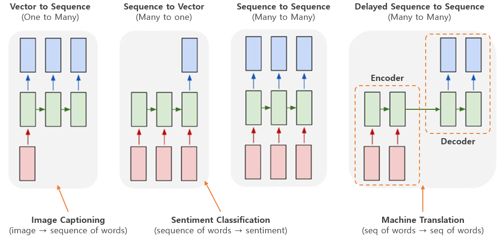

# 07. 순환 신경망 (RNN, Recurrent Neural Network)

저번 포스팅인 [06. 합성곱 신경망 - CNN](http://excelsior-cjh.tistory.com/180)에서는 이미지 데이터에 적합한 모델인 CNN에 대해 알아보았다. 이번 포스팅에서는 아래의 그림과 같이 자연어(NL, Natural Language)나 음성신호, 주식과 같은 연속적인(sequential) **시계열**(time series) 데이터에 적합한 모델인 **RNN**(Recurrent Neural Network)에 대해 알아보도록 하자.

## 1. 순환 뉴런(Recurrent Neurons)

[이전 포스팅](http://excelsior-cjh.tistory.com/category/DeepLearning/%EA%B0%9C%EB%85%90)에서 살펴본 신경망은 입력층 → 출력층 한 방향으로만 흐르는 피드포워드(feedforward) 신경망이었다.  RNN(순환 신경망)은 피드포워드 신경망과 비슷하지만, 아래의 그림과 같이 출력이 다시 입력으로 받는 부분이 있다. 

 

RNN은 입력($\mathbf{x}$)을 받아 출력($\mathbf{y}$)를 만들고, 이 출력을 다시 입력으로 받는다.  일반적으로 RNN을 그림으로 나타낼 때는 위의 그림처럼 하나로 나타내지 않고, 아래의 그림처럼 각 **타임 스텝**(time step) $t$ 마다 **순환 뉴런**을 펼쳐서 타임스텝 별 입력($x_t$)과 출력($y_t$)을 나타낸다. 

순환 뉴런으로 구성된 층(layer)은 아래의 그림처럼 나타낼 수 있는데, 타임 스텝 $t$ 마다 모든 뉴런은 입력 벡터 $\mathbf{x}_t$와 이전 타임 스텝의 출력 벡터 $\mathbf{y}_{t-1}$을 입력 받는다.

각 순환 뉴런은 두 개의 가중치 $\mathbf{w}_{x}$ 와 $\mathbf{w}_{y}$ 를 가지는데, $\mathbf{w}_{x}$ 는 $\mathbf{x}_{t}$ 를 위한 것이고 $\mathbf{w}_{y}$는  이전 타임 스텝의 출력 $\mathbf{y}_{t-1}$을 위한 것이다. 이것을 순환 층(layer) 전체로 생각하면 가중치 벡터 $\mathbf{w}_{x}$ 와 $\mathbf{w}_{y}$ 를 행렬 $\mathbf{W}_{x}$ 와 $\mathbf{W}_{y}$ 로 나타낼 수 있으며 다음의 식과 같이 표현할 수 있다.

 

$$
\mathbf{y}_{t} = \phi \left( \mathbf{W}_{x}^{T}\cdot\mathbf{x}_{t} + \mathbf{W}_{y}^{T} \cdot\mathbf{y}_{t-1} + \mathbf{b} \right)
$$

그리고 타임 스텝 $t$ 에서의 미니배치(mini-batch)의 입력을 행렬 $\mathbf{X}_{t}$ 로 나타내어 아래와 같이 순환 층의 출력을 한번에 계산할 수 있다.

$$
\begin{align*}
\mathbf{Y}_{t} &= \phi \left( \mathbf{X}_{t} \cdot \mathbf{W}_{x} + \mathbf{Y}_{t-1} \cdot \mathbf{W}_{y} + \mathbf{b} \right) \\ &= \phi \left( \begin{bmatrix} \mathbf{X}_{t} & \mathbf{Y}_{t-1} \end{bmatrix}\begin{bmatrix} \mathbf{W}_{x} \\ \mathbf{W}_{y} \end{bmatrix} + \mathbf{b} \right)
\end{align*}
$$

- $\mathbf{Y}_{t}$ : 타임 스텝 $t$에서 미니배치에 있는 각 샘플(미니배치)에 대한 순환 층의 출력이며, $m \times n_{\text{neurons}}$ 행렬($m$은 미니배치, $n_{\text{neurons}}$은 뉴런 수)
- $\mathbf{X}_{t}$ : 모든 샘플의 입력값을 담고 있는 $m \times n_{\text{inputs}}$ 행렬 ($n_{\text{inputs}}$은 입력 특성 수)
- $\mathbf{W}_{x}$ : 현재 타임 스텝 $t$의 입력에 대한 가중치를 담고 있는 $n_{\text{inputs}} \times n_{\text{neurons}}$ 행렬
- $\mathbf{W}_{y}$  : 이전 타임 스텝 $t-1$ 의 출력에 대한 가중치를 담고 있는 $n_{\text{neurons}} \times n_{\text{neurons}}$  행렬
- $\mathbf{b}$ : 각 뉴런의 편향(bias)을 담고 있는 $n_{\text{neurons}}$ 크기의 벡터

위의 식에서 $\mathbf{Y}_{t}$ 는 $\mathbf{X}_t$ 와 $\mathbf{Y}_{t-1}$의 함수이므로, 타임 스텝 $t=0$ 에서부터 모든 입력에 대한 함수가 된다. 첫 번째 타임 스텝인 $t=0$ 에서는 이전의 출력이 없기 때문에 일반적으로 $0$으로 초기화 한다.

### 1.1 메모리 셀

타임 스텝 $t$ 에서 순환 뉴런의 출력은 이전 타임 스텝의 모든 입력에 대한 함수이기 때문에 이것을 **메모리**라고 볼 수 있다. 이렇게 타임 스텝에 걸쳐 어떠한 상태를 보존하는 신경망의 구성 요소를 **메모리 셀**(memory cell)이라고 한다. 일반적으로 타임 스텝 $t$ 에서 셀의 상태 $\mathbf{h}_{t}$ (h = hidden)는 아래의 식과 같이 타임 스텝에서의 입력과 이전 타임 스텝의 상태에 대한 함수이다.  
$$
\mathbf{h}_{t} = f \left( \mathbf{h}_{t-1}, \mathbf{x}_{t} \right)
$$

위에서 살펴본 RNN은 출력 $\mathbf{y}_{t}$ 가 다시 입력으로 들어갔지만, 아래의 그림과 같이 일반적으로 많이 사용되는 RNN은 출력 $\mathbf{y}_{t}$ 와 히든 상태(state) $\mathbf{h}_{t}$가 구분되며, 입력으로는 $\mathbf{h}_{t}$가 들어간다. RNN에서의 활성화 함수로는 $\tanh$가 주로 사용되는데, 그 이유는 LSTM을 살펴볼 때 알아보도록 하자.

위의 그림을 식으로 나타내면 다음과 같다.

$$
\begin{align*}
\mathbf{h}_{t} &= \tanh \left( \mathbf{X}_{t} \cdot \mathbf{W}_{x} + \mathbf{h}_{t-1} \cdot \mathbf{W}_{h} + \mathbf{b} \right) \\ &= \tanh \left( \begin{bmatrix} \mathbf{X}_{t} & \mathbf{h}_{t-1} \end{bmatrix}\begin{bmatrix} \mathbf{W}_{x} \\ \mathbf{W}_{h} \end{bmatrix} + \mathbf{b} \right) \\ \mathbf{Y}_{t} &= \mathbf{W}_{y}^{T} \cdot \mathbf{h}_{t}
\end{align*}
$$

### 1.2 입력과 출력 시퀀스

RNN은 아래의 그림(출처: [cs231n](http://cs231n.stanford.edu/2017/syllabus.html))과 같이 다양한 입력 시퀀스(sequence)를 받아 출력 시퀀스를 만들 수 있다. 

위의 그림에서 Vector-to-Sequence는 첫 번째 타임 스텝에서 하나의 입력만(다른 모든 타임 스텝에서는 0)을 입력받아 시퀀스를 출력하는 네트워크이며, 이러한 모델은 Image Captioning에 사용할 수 있다. Sequence-to-Vector는 Vector-to-Sequence와는 반대로 입력으로 시퀀스를 받아 하나의 벡터를 출력하는 네트워크로, Sentiment Classification에 사용할 수 있다.  

위의 그림의 오른쪽에서 세 번째 Sequence-to-Sequence 는 시퀀스를 입력받아 시퀀스를 출력하는 네트워크이며, 주식가격과 같은 시계열 데이터를 예측하는 데 사용할 수 있다.  마지막으로 Delayed Sequence-to-Sequence 는 **인코더**(encoder)에는 seq-to-vec 네트워크를 **디코더**(decoder)에는 vec-to-seq 네트워크를 연결한 것으로, 기계 번역에 사용된다.

## 2. 텐서플로로 기본 RNN 구성하기

위에서 살펴본 RNN을 텐서플로(TensorFlow)를 이용해 구현해보도록 하자. 먼저, RNN의 구조를 살펴보기 위해 텐서플로에서 제공하는 RNN을 사용하지 않고, 간단한 RNN 모델을 구현해 보도록 하자.

아래의 코드는 $\tanh$ 를 활성화 함수로 사용하고, 5개의 뉴런으로 구성된 RNN을 구현 하였으며, 타임 스텝마다 크기 3의 입력을 받고 두개의 타임 스텝($t=0, t=1$)에 대해 작동한다. 