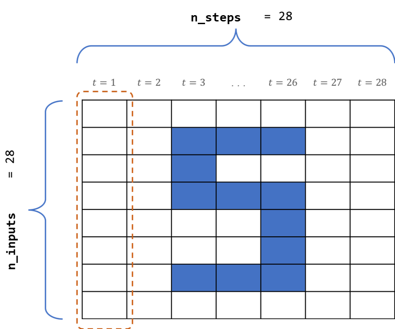

# 07-2. 순환 신경망 (RNN, Recurrent Neural Network) - (2)


저번 포스팅인 [07-1. 순환 신경망 - (1)](http://excelsior-cjh.tistory.com/183)에서는 시계열 데이터에 적합한 모델인 RNN의 구조와 텐서플로(TensorFlow)의 `BasicRNNCell`과 `static_rnn()`, `dynamic_rnn()`을 이용해 RNN을 구현하는 방법에 대해 알아보았다. 이번 포스팅에서는 RNN을 학습시키는 방법과 심층 RNN에 대해 알아보도록 하자.


## 1. RNN 학습시키기 

### 1.1 BPTT (BackPropagation Through Time)

RNN은 기존 신경망의 역전파(backprop)와는 달리 타임 스텝별로 네트워크를 펼친 다음, 역전파 알고리즘을 사용하는데 이를 **BPTT**(BackPropagation Through Time)라고 한다. 


BPTT 또한 일반적인 역전파와 같이 먼저 순전파(forward prop)로 각 타임 스텝별 시퀀스를 출력한다. 그런다음 이 출력 시퀀스와 손실(비용)함수를 사용하여 각 타임 스텝별 Loss를 구한다. 그리고 손실 함수의 그래디언트는 위의 그림과 같이 펼쳐진 네트워크를 따라 역방향으로 전파된다. BPTT는 그래디언트가 마지막 타임 스텝인 출력뿐만 아니라 손실함수를 사용한 모든 출력에서 역방향으로 전파된다.  

RNN은 각 타임 스텝마다 같은 매개변수 $\mathbf{W}$ 와 $\mathbf{b}$ 이 사용되기 때문에 역전파가 진행되면서 모든 타임 스텝에 걸쳐 매개변수 값이 합산된다. 이렇게 업데이트된 가중치는 순전파 동안에는 모든 타임 스텝에 동일한 가중치가 적용된다.


### 1.2 Truncated BPTT

3.1에서 살펴본 BPTT는 전체의 타임 스텝마다 처음부터 끝까지 역전파를 하기 때문에 타임 스텝이 클 수록 계산량이 많아지는 문제가 있다. 이러한 계산량 문제를 해결하기 위해 전체 타임 스텝을 일정 구간(예를들어 3 또는 5 구간)으로 나눠 역전파를 하는 **Truncated BPTT**를 사용한다. 


### 1.3 RNN을 이용한 분류기 구현

 이번에는 RNN을 이용해 MNIST 숫자 이미지 데이터셋을 분류하는 분류기를 구현해보자. MNIST와 같은 이미지 데이터는 이전 포스팅 [06. 합성곱 신경망](http://excelsior-cjh.tistory.com/180)에서 살펴본 이미지의 공간(spatial) 구조를 활용하는 CNN 모델이 더 적합하지만, 인접한 영역의 픽셀은 서로 연관되어 있으므로 이를 시퀀스 데이터로 볼 수도 있다.   아래의 그림처럼 MNIST 데이터에서 `28 x 28` 픽셀을 시퀀스의 각원소는 `28`개의 픽셀을 가진 길이가 `28` 시퀀스 데이터로 볼 수 있다.




아래의 코드는 텐서플로(TensorFlow)의 `BasicRNNCell`과 `dynamic_rnn()`을 이용해 MNIST 분류기를 구현한 코드이다.

```python

```

