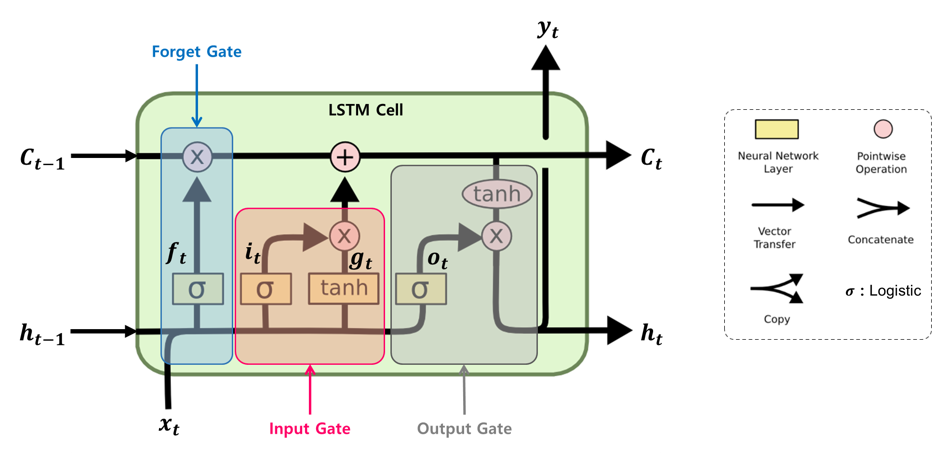
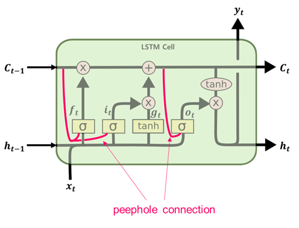
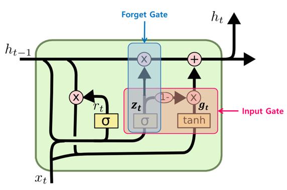

>  이번 포스팅은 [핸즈온 머신러닝](http://www.yes24.com/24/goods/59878826?scode=032&OzSrank=1) 교재, cs231n 강의를 가지고 공부한 것을 정리한 포스팅입니다. RNN에 대해 좀더 간략하게 알고 싶으신 분들은 아래의 링크를 참고하면 됩니다. 
>
> - **텐서플로 실습 위주** : [ [러닝 텐서플로]Chap06 - 텍스트2: word2vec, Bidirectional RNN, GRU, 임베딩 시각화](http://excelsior-cjh.tistory.com/156?category=940399)
> - **LSTM & GRU의 간략한 설명** : [RNN - LSTM(Long Short Term Memory networks)](http://excelsior-cjh.tistory.com/89?category=1013831)


# 07-3. 순환 신경망 (RNN, Recurrent Neural Network) - (3)

저번 포스팅인 [07-2. 순환 신경망(RNN) - (2)](http://excelsior-cjh.tistory.com/184)에서는 RNN을 학습시키는 방법인 BPTT와 텐서플로를 이용해 MNIST 분류기와 시계열 데이터를 예측하는 RNN 모델을 구현해 보았다. 그리고 심층 RNN을 구현하는 방법과 RNN에 드롭아웃을 적용하는 방법에 대해 알아보았다. 

이번 포스팅에서는 RNN의 변형이라고 할 수 있는 LSTM과 LSTM의 변형인 GRU에 대해 알아보도록 하자.


## 1. RNN Cell의 문제점

### 1.1 BPTT의 문제점

[저번 포스팅](http://excelsior-cjh.tistory.com/184)에서 살펴본 BPTT는 RNN에서의 역전파 방법인 BPTT(BackPropagation Through Time)은 아래의 그림과 같이 모든 타임스텝마다 처음부터 끝까지 역전파한다.


그렇기 때문에 타임 스텝이 클 경우, 위의 그림과 같이 RNN을 펼치게(unfold)되면 매우 깊은 네트워크가 될것이며, 이러한 네트워크는 [05-1. 심층 신경망 학습](http://excelsior-cjh.tistory.com/177?category=940400)에서 살펴본 **그래디언트 소실 및 폭주**(vanishing & exploding gradient) 문제가 발생할 가능성이 크다. 그리고, 계산량 또한 많기 때문에 한번 학습하는데 아주 오랜 시간이 걸리는 문제가 있다. 


#### Truncated BPTT

BPTT의 이러한 문제를 해결하기 위해 아래의 그림과 같이 타임 스텝을 일정 구간(보통 5-steps)으로 나누어 역전파(backprop)를 계산하여, 전체 역전파로 근사시키는 방법인 **Truncated BPTT**를  대안으로 사용할 수 있다. 


하지만 truncated-BPTT의 문제는 만약 학습 데이터가 장기간에 걸쳐 패턴이 발생한다고 하면, 이러한 장기간(Long-Term)의 패턴을 학습할 수 없는 문제가 있다. 


### 1.2 장기 의존성(Long-Term Dependency) 문제

[저번 포스팅](http://excelsior-cjh.tistory.com/183)에서 살펴 보았듯이 RNN은 타임 스텝 $t$에서 이전 타임 스텝($t-1$)의 상태(state, $h_{t-1}$)를 입력으로 받는 구조이기 때문에,  이전의 정보가 현재의 타임 스텝 $t$에 영향을 줄 수 있다. 따라서, RNN의 순환 뉴런(Reccurent Neurons)의 출력은 이전 타임 스텝의 모든 입력에 대한 함수이므로, 이를 **메모리 셀(memory cell)**이라고 한다. 

이렇듯, RNN은 이론적으로 모든 이전 타임 스텝이 영향을 주지만 앞쪽의 타임 스텝(예를 들어 $t=0, t=1$)은 타임 스텝이 길어질 수록 영향을 주지 못하는 문제가 발생하는데 이를 **장기 의존성(Long-Term Dependency) 문제**라고 한다. 이러한 문제가 발생하는 이유는 입력 데이터가 RNN Cell을 거치면서 특정 연산을 통해 데이터가 변환되어, 일부 정보는 타임 스텝마다 사라지기 때문이다.


이러한 문제를 해결하기 위해 장기간의 메모리를 가질 수 있는 여러 종류의 셀이 만들어졌는데, 그 중에서 대표적인 셀들이 LSTM과 GRU 셀이다. 먼저, LSTM 셀에 대해 알아보도록 하자.


## 2. LSTM Cell

[**LSTM**(Long Short-Term Memory) 셀](https://www.mitpressjournals.org/doi/abs/10.1162/neco.1997.9.8.1735#.WIxuWvErJnw)은 S.Hochreiter와 J.Schmidhuber가 1997년에 제안한 셀로써, RNN 셀의 장기 의존성 문제를 해결할 뿐만 아니라 학습 또한 빠르게 수렴한다. LSTM 셀의 구조는 아래의 그림(원 출처: [colah's blog](http://colah.github.io/posts/2015-08-Understanding-LSTMs/))과 같다.





위의 그림에서 보면 LSTM 셀에서는 상태(state)가 두 개의 벡터 $\mathbf{h}_t$와 $\mathbf{c}_t$로 나누어 진다는 것을 알 수 있다. $\mathbf{h}_t$를 단기 상태(short-term state), $\mathbf{c}_t$를 장기 상태(long-term state)라고 볼 수 있다. 

위의 LSTM 셀을 자세히 살펴보도록 하자. LSTM의 핵심은 네트워크가 장기 상태($\mathbf{c}_t$)에서 기억할 부분, 삭제할 부분,  그리고 읽어 들일 부분을 학습하는 것이다. 장기 기억 $\mathbf{c}_{t-1}$은 셀의 왼쪽에서 오른쪽으로 통과하게 되는데 **forget gate**를 지나면서 일부를 기억(정보)을 잃고, 그 다음 덧셈(+) 연산으로 **input gate**로 부터 새로운 기억 일부를 추가한다. 이렇게 만들어진 $\mathbf{c}_t$는 별도의 추가 연산 없이 바로 출력되며, 이러한 장기 기억 $\mathbf{c}_t$는 타임 스텝마다 일부의 기억을 삭제하고 추가하는 과정을 거치게 된다. 그리고 덧셈 연산 후에 $\mathbf{c}_t$는 복사되어 **output gate**의 $\tanh$함수로 전달되어 단기 상태 $\mathbf{h}_{t}$와 셀의 출력인 $\mathbf{y}_t$를 만든다. 이번에는 위에서 설명한 forget, input, output 게이트(gate)가 어떻게 작동하는지에 대해 알아보도록 하자. 

먼저, 현재 입력 벡터 $\mathbf{x}_{t}$와 이전의 단기 상태 $\mathbf{h}_{t-1}$이 **네 개의 다른 FC-레이어(Fully-Connected layer)에 주입**되는데, 이 레이어는 모두 다음과 같이 다른 목적을 가진다.

- 주요 레이어는 $\mathbf{g}_t​$를 출력하는 레이어이며, 현재 입력 데이터 $\mathbf{x}_t​$와 이전 타임스텝의 단기 상태 $\mathbf{h}_{t-1}​$을 분석하는 역할을 한다. LSTM 셀에서는 이 레이어의 출력인 $\mathbf{g}_{t}​$가 $\mathbf{i}_{t}​$의 곱셈($\times​$)연산 후 장기 상태 $\mathbf{c}_{t}​$에 일부분이 더해지게 된다. 반면에, [기본 RNN 셀](http://excelsior-cjh.tistory.com/183)에서는 이 레이어만 있으며, 바로 $\mathbf{y}_{t}​$와 $\mathbf{h}_{t}​$로 출력된다. 

- $\mathbf{f}_{t}, \mathbf{i}_{t}, \mathbf{o}_{t}$를 출력하는 세 개의 레이어에서는 활성화 함수로 시그모이드(sigmoid, logistic)를 사용한다. 시그모이드 함수의 출력의 범위는 0 ~ 1 이며, 이 출력값은 각 forget, input, output 게이트의 원소별(element-wise) 곱셈연산에 입력된다. 따라서, 출력이 `0`일 경우에는 게이트를 닫고 `1`일 경우에는 게이트를 열기 때문에  $\mathbf{f}_{t}, \mathbf{i}_{t}, \mathbf{o}_{t}$를 **gate controller**라고 한다.
  - **Forget gate** : $\mathbf{f}_{t}$에 의해 제어되며 장기 상태 $\mathbf{c}_{t}$의 어느 부분을 삭제할지 제어한다.
  - **Input gate** : $\mathbf{i}_{t}$에 의해 제어되며 $\mathbf{g}_{t}$의 어느 부분이 장기 상태 $\mathbf{c}_{t}$에 더해져야 하는지 제어한다.
  - **Output gate** : $\mathbf{o}_{t}$는 장기 상태 $\mathbf{c}_{t}$의 어느 부분을 읽어서 $\mathbf{h}_{t}$ 와 $\mathbf{y}_{t}$로 출력해야 하는지 제어한다.


다음의 식은 위의 그림에서 타임 스텝 $t$에서, 셀의 장기 상태, 단기 상태, 그리고 각 레이어의 출력을 구하는 식을 나타낸 것이다.


$$
\begin{eqnarray} 
\mathbf{f}_{t} & = & \sigma \left( \mathbf{W}_{xf}^{T} \cdot \mathbf{x}_{t} + \mathbf{W}_{hf}^{T} \cdot \mathbf{h}_{t-1} + \mathbf{b}_{f} \right) \\ \mathbf{i}_{t} & =  & \sigma \left( \mathbf{W}_{xi}^{T} \cdot \mathbf{x}_{t} + \mathbf{W}_{hi}^{T} \cdot \mathbf{h}_{t-1} + \mathbf{b}_{i} \right) \\ \mathbf{o}_{t} & = & \sigma \left( \mathbf{W}_{xo}^{T} \cdot \mathbf{x}_{t} + \mathbf{W}_{ho}^{T} \cdot \mathbf{h}_{t-1} + \mathbf{b}_{o} \right) \\ \mathbf{g}_{t} & = & \tanh \left( \mathbf{W}_{xg}^{T} \cdot \mathbf{x}_{t} + \mathbf{W}_{hg}^{T} \cdot \mathbf{h}_{t-1} + \mathbf{b}_{g} \right) \\ \mathbf{c}_{t} & = & \mathbf{f}_{t} \otimes \mathbf{c}_{t-1} + \mathbf{i}_{t} \otimes \mathbf{g}_{t} \\ \mathbf{y}_{t}, \mathbf{h}_{t} & = & \mathbf{o}_{t} \otimes \tanh \left( \mathbf{c}_{t} \right) 
\end{eqnarray}
$$


- $\mathbf{W}_{xf}, \mathbf{W}_{xi}, \mathbf{W}_{xo}, \mathbf{W}_{xg}$ : 입력 벡터 $\mathbf{x}_{t}$에 연결된 네 개의 레이어에 대한 가중치 행렬
- $\mathbf{W}_{hf}, \mathbf{W}_{hi}, \mathbf{W}_{ho}, \mathbf{W}_{hg}$ : 이전 타임스텝의 단기 상태 $\mathbf{h}_{t-1}$에 연결된 네 개의 레이어에 대한 가중치 행렬
- $\mathbf{b}_{f}, \mathbf{b}_{i}, \mathbf{b}_{o}, \mathbf{b}_{g}$ : 네 개의 레이어에 대한 편향(bias), [텐서플로](https://www.tensorflow.org/api_docs/python/tf/nn/rnn_cell/LSTMCell)(TensorFlow)에서는 $\mathbf{b}_{f}$ 를 `1`로 초기화하여 학습 시작시에 모든것을 잃어버리는 것을 방지한다.


### 2.1 텐서플로에서의 LSTM 셀

텐서플로(TensorFlow)에서는 [`tf.nn.rnn_cell.BasicLSTMCell`](https://www.tensorflow.org/api_docs/python/tf/nn/rnn_cell/BasicLSTMCell)을 이용해 LSTM 셀을 구현할 수 있으며, `BasicLSTMCell` 사용법은 '[07-1. 순환 신경망(RNN)](http://excelsior-cjh.tistory.com/183)'에서의 예제에서 아래의 코드와 같이 `BasicRNNCell` → `BasicLSTMCell`로 바꿔주면 된다. ( *2018.10.29기준 텐서플로의* `1.11.0` *버전에서는* `BasicRNNCell` *을 사용할 경우 'deprecated' Warning이 나타나기 때문에* `LSTMCell` *을 사용하는 것이 좋다.* )

```python
lstm_cell = tf.nn.rnn_cell.BasicLSTMCell(num_units=n_neurons)
```


### 2.2 핍홀(peephole) 연결

핍홀 연결(peephole connection)은 2000년에 F. Gers와 J.Schmidhuber가 ['Recurrent Nets that and Count'](ftp://ftp.idsia.ch/pub/juergen/TimeCount-IJCNN2000.pdf) 논문에서 제안한 LSTM의 변종이다. 기존의 LSTM에서 gate controller($\mathbf{f}_{t}, \mathbf{i}_{t}, \mathbf{o}_{t}$)는 입력 $\mathbf{x}_{t}$와 이전 타임스텝의 단기 상태 $\mathbf{h}_{t-1}$만 입력으로 받는다. 하지만 위의 논문에서 제안한 핍홀 연결을 아래의 그림과 같이 연결 해주면서 gate controller에 이전 타임스텝의 장기 상태 $\mathbf{c}_{t-1}$가 입력으로 추가되며, 좀 더 많은 맥락(context)를 인식할 수 있다.


$$
\begin{eqnarray} 
\mathbf{f}_{t} & = & \sigma \left( \mathbf{W}_{cf}^{T} \cdot \mathbf{c}_{t-1} + \mathbf{W}_{xf}^{T} \cdot \mathbf{x}_{t} + \mathbf{W}_{hf}^{T} \cdot \mathbf{h}_{t-1} + \mathbf{b}_{f} \right) \\ \mathbf{i}_{t} & =  & \sigma \left( \mathbf{W}_{ci}^{T} \cdot \mathbf{c}_{t-1} + \mathbf{W}_{xi}^{T} \cdot \mathbf{x}_{t} + \mathbf{W}_{hi}^{T} \cdot \mathbf{h}_{t-1} + \mathbf{b}_{i} \right) \\ \mathbf{o}_{t} & = & \sigma \left( \mathbf{W}_{co}^{T} \cdot \mathbf{c}_{t-1} + \mathbf{W}_{xo}^{T} \cdot \mathbf{x}_{t} + \mathbf{W}_{ho}^{T} \cdot \mathbf{h}_{t-1} + \mathbf{b}_{o} \right)
\end{eqnarray}
$$



텐서플로에서 핍홀 연결을 구현하기 위해서는 `BasicLSTMCell` 대신 [`LSTMCell`](https://www.tensorflow.org/api_docs/python/tf/nn/rnn_cell/LSTMCell)을 사용하고 `use_peepholes`인자를 `True`로 설정하면 된다.

```python
# Use peephole
lstm_cell = tf.nn.rnn_cell.LSTMCell(num_units=n_neurons, use_peepholes=True)
```


## 3. GRU Cell

**GRU(Gated Recurrent Unit)** 셀은 2014년에 K. Cho(조경현) 등에 의해 ['이 논문'](https://arxiv.org/pdf/1406.1078v3.pdf)에서 제안된 LSTM 셀의 **간소화된 버전**이라고 할 수 있으며, 다음의 그림과 같은 구조를 가진다.





- LSTM Cell에서의 두 상태 벡터 $\mathbf{c}_{t}$와 $\mathbf{h}_{t}$가 하나의 벡터 $\mathbf{h}_{t}$로 합쳐졌다.
- 하나의 gate controller인 $\mathbf{z}_{t}$가 **forget**과 **input** 게이트(gate)를 모두 제어한다.  $\mathbf{z}_{t}$가 `1`을 출력하면 forget 게이트가 열리고 input 게이트가 닫히며, $\mathbf{z}_{t}$가 `0`일 경우 반대로 forget 게이트가 닫히고 input 게이트가 열린다. 즉, 이전($t-1$)의 기억이 저장 될때 마다 타임 스텝 $t$의 입력은 삭제된다. 
- GRU 셀은 output 게이트가 없어 전체 상태 벡터 $\mathbf{h}_{t}$가 타임 스텝마다 출력되며, 이전 상태 $\mathbf{h}_{t-1}$의 어느 부분이 출력될지 제어하는 새로운 gate controller인 $\mathbf{r}_{t}$가 있다.


GRU 셀의 상태(state)와 각 레이어의 출력을 계산하는 식은 다음과 같다.


$$
\begin{eqnarray} 
\mathbf{r}_{t} & = & \sigma \left( \mathbf{W}_{xr}^{T} \cdot \mathbf{x}_{t} + \mathbf{W}_{hr}^{T} \cdot \mathbf{h}_{t-1} + \mathbf{b}_{r} \right) \\ \mathbf{z}_{t} & =  & \sigma \left( \mathbf{W}_{xz}^{T} \cdot \mathbf{x}_{t} + \mathbf{W}_{hz}^{T} \cdot \mathbf{h}_{t-1} + \mathbf{b}_{z} \right) \\ \mathbf{g}_{t} & = & \tanh \left( \mathbf{W}_{xg}^{T} \cdot \mathbf{x}_{t} + \mathbf{W}_{hg}^{T} \cdot \left( \mathbf{r}_{t} \otimes \mathbf{h}_{t-1} \right) + \mathbf{b}_{g} \right) \\ \mathbf{h}_{t} & = & \mathbf{z}_{t} \otimes \mathbf{h}_{t-1} + \left( 1 - \mathbf{z}_{t} \right) \otimes \mathbf{g}_{t}
\end{eqnarray}
$$


텐서플로에서 GRU 셀은 [`tf.nn.rnn_cell.GRUCell`](https://www.tensorflow.org/api_docs/python/tf/nn/rnn_cell/GRUCell)을 이용해 다음과 같이 구현할 수 있다.

```python
# GRU Cell
gru_cell = tf.nn.rnn_cell.GRUCell(num_units=n_neurons)
```


## 4. 마무리

이번 포스팅에서는 RNN의 문제인 BPTT와 Long-Term Dependency 문제에 대해 알아 보았고, 그리고 RNN의 변형인 LSTM, LSTM의 변형인 GRU에 대해 알아보았다. 위의 코드에 대한 전체 코드는 https://github.com/ExcelsiorCJH/Hands-On-ML/blob/master/Chap14-Recurrent_Neural_Networks/Chap14_3-Recurrent_Neural_Networks.ipynb 에서 확인할 수 있다. 